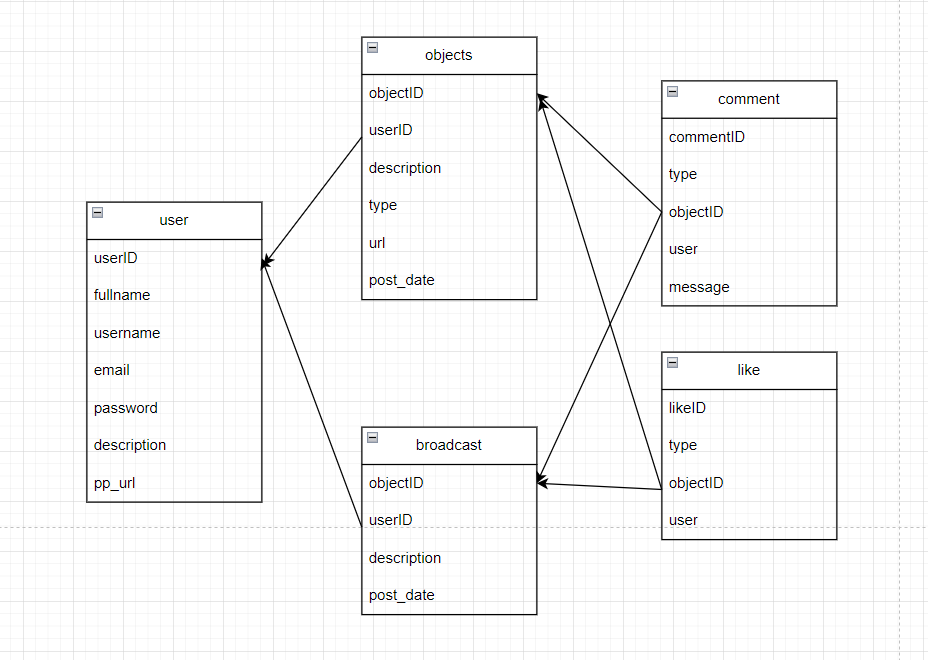

# IF3110-2023-02-03
# Spaces - REST Service

> Disusun untuk memenuhi Tugas Besar IF3110 Pengembangan Aplikasi Berbasis Web

## Daftar Isi

-   [Deskripsi Aplikasi _Web_](#deskripsi-aplikasi-web)
-   [Tim Pengembang](#tim-pengembang)
-   [Struktur Program](#struktur-program)
-   [Daftar _Requirement_](#daftar-requirement)
-   [Cara Instalasi](#cara-instalasi)
-   [Cara Menjalankan _Server_](#cara-menjalankan-server)
-   [Screenshot Tampilan Aplikasi](#screenshot-tampilan-aplikasi)
-   [Entity Relationship Diagram](#entity-relationship-diagram)
-   [Pembagian Tugas](#pembagian-tugas)

## Deskripsi Aplikasi _Web_

Spaces merupakan aplikasi berbagi konten dari creator. Creator dapat mempublikasikan seluruh karyanya melalui aplikasi ini. REST Service merupakan server utama pada aplikasi Spaces ini. Dibangun dengan menggunakan ExpressJS dan PostgreSQL dengan TypeORM. 

## Tim Pengembang

| Nama                        | NIM      | Panggilan |
| ----------------------      | -------- | --------- |
| Mutawally Nawwar            | 13521065 | Nawwar    |
| Ghazi Akmal Fauzan          | 13521058 | Ghazi  |
| Antonio Natthan Krishna     | 13521162 | Nate    |
| Ahmad Hapinuddin    | 10023079 | Hapid     |

## Cara Instalasi

1. Lakukan pengunduhan _repository_ ini dengan menggunakan perintah `git clone https://github.com/natthankrish/IF3110-20230103.git` pada terminal komputer Anda.
2. Pastikan komputer Anda telah menginstalasi dan menjalankan aplikasi Docker.
3. Lakukan pembuatan _image_ Docker yang akan digunakan oleh aplikasi ini dengan menjalankan perintah `docker build -t tubes-1:latest .` pada terminal _directory_ aplikasi web.
4. Buatlah sebuah file `.env` yang bersesuaian dengan penggunaan (contoh file tersebut dapat dilihat pada `.env.example`).

## Cara Menjalankan _Server_

1. Anda dapat menjalankan program ini dengan menjalankan perintah `docker-compose up -d` pada terminal _directory_ aplikasi web.
2. Aplikasi web dapat diakses dengan menggunakan browser pada URL `http://localhost:8080/public/home`.
3. Aplikasi web dapat dihentikan dengan menjalankan perintah perintah `docker-compose down` pada terminal _directory_ aplikasi web.

## Skema Basis Data

## Endpoint API
| Endpoint API | Fungsi|
|--------------|-------|
| POST /broadcast: | Menambahkan broadcast baru. |
| POST /broadcast/like/:id: | Menambahkan suka ke broadcast tertentu yang diidentifikasi oleh :id.|
| POST /broadcast/comment/:id: | Menambahkan komentar ke broadcast tertentu yang diidentifikasi oleh :id. |
| GET /broadcast: | Mengambil informasi tentang broadcast. |
| GET /broadcast/like/:id: | Mengambil suka untuk broadcast tertentu yang diidentifikasi oleh :id. | 
| GET /broadcast/like: | Memeriksa apakah pengguna saat ini telah menyukai broadcast apa pun. |
| GET /broadcast/comment/:id: | Mengambil komentar untuk broadcast tertentu yang diidentifikasi oleh :id. |
| GET /broadcast/comment: | Mengambil komentar yang dibuat oleh pengguna saat ini.
PUT /broadcast/:id: | Memperbarui informasi untuk broadcast tertentu yang diidentifikasi oleh :id. |
| DELETE /broadcast/:id: | Menghapus broadcast tertentu yang diidentifikasi oleh :id. |
| DELETE /broadcast/like/:id/:name: | Menghapus suka untuk broadcast tertentu yang diidentifikasi oleh :id dan :name (asumsi bahwa :name digunakan untuk mengidentifikasi pengguna yang menyukainya). |
| DELETE /broadcast/comment/:id: | Menghapus komentar untuk broadcast tertentu yang diidentifikasi oleh :id. |
| POST /content: | Menambahkan konten baru dan menangani pengunggahan konten.| 
| POST /content/like/:id: | Menambahkan suka untuk konten tertentu yang diidentifikasi oleh :id.| 
| POST /content/comment/:id: | Menambahkan komentar untuk konten tertentu yang diidentifikasi oleh :id.| 
| GET /content: | Mengambil informasi tentang konten.| 
| GET /content/src/:name: | Mengambil sumber (source) untuk konten yang diidentifikasi oleh :name.| 
| GET /content/like/:id: | Mengambil suka untuk konten tertentu yang diidentifikasi oleh :id. | 
| GET /content/like: | Memeriksa apakah pengguna saat ini menyukai konten apa pun. | 
| GET /content/comment/:id: | Mengambil komentar untuk konten tertentu yang diidentifikasi oleh :id. | 
| GET /content/comment: | Mengambil komentar yang dibuat oleh pengguna saat ini.| 
| PUT /content/:id: | Memperbarui informasi untuk konten tertentu yang diidentifikasi oleh :id.| 
| DELETE /content/:id: | Menghapus konten tertentu yang diidentifikasi oleh :id.
| DELETE /content/comment/:id: | Menghapus komentar untuk konten tertentu yang diidentifikasi oleh :id.
| DELETE /content/like/:id/:name: | Menghapus suka untuk konten tertentu yang diidentifikasi oleh :id dan :name (asumsi bahwa :name digunakan untuk mengidentifikasi pengguna yang menyukainya).
| DELETE /content/src/:name: | Menghapus sumber (source) untuk konten yang diidentifikasi oleh :name.
| PUT /follower: | Memperbarui nama pengguna pengikut.
| POST /follow/accept | Menerima permintaan mengikuti.
| POST /follow/reject | Menolak permintaan mengikuti.
| GET /follow | Mendapatkan informasi tentang pengikut.
| GET /follow-count |  Mendapatkan jumlah pengikut.
| GET /pending-follow | Mendapatkan informasi tentang pengikut yang masih dalam status tertunda.
| POST /contents | Menambahkan konten baru.
| POST /user/token | Menghasilkan token untuk otentikasi pengguna.
| POST /user | Menyimpan informasi pengguna baru.
| POST /user/profile | Menambahkan konten ke profil pengguna dan menangani pengunggahan konten.
| PUT /user| Memperbarui informasi pengguna.
| GET /user| Mendapatkan informasi pengguna.
| GET /user/profile/:name| Mendapatkan sumber (source) profil pengguna berdasarkan nama.
| GET /user/info| Mendapatkan informasi tambahan tentang pengguna.
| GET /get-followers-count| Mendapatkan jumlah pengikut untuk pengguna yang diotentikasi.
| GET /user/check| Memeriksa keberadaan pengguna yang diotentikasi.

## BONUS
Docker 

## **Pembagian Kerja - Workload Breakdown**

| NIM                | Nama            | Fungsionalitas                            |
| ------------------ | --------------- |------------------------------------------ |
| 13521065           | Nawwar           | SOAP Connection, Follower Controller and Routing                        |
| 13521058           | Ghazi            | Setup and Build, User Controller and Routing                  |
| 13521162           | Nate             | Like, Comment, Content, Broadcast Controller and Routing |

